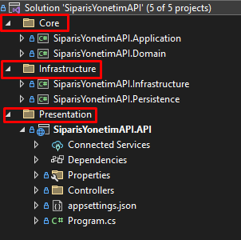

# Kullanılan Teknolojiler

- Onion Architecture
- .NET Core 6 API
- MSSQL
- Swagger UI
- Entity Framework Code First
- Repository Design Pattern

### Diğer

Id için BaseEntity classı kullanılmıştır.

---

# Proje Aşamaları

1. Onion Architecture altyapısı projeye inşaa edilmiştir.
2. Swagger UI ile Onion Architecture altyapısı test edilmiştir.
3. Entity Framework Code First yaklaşımı ile MSQL veritabanı oluşturulmuştur.
4. Generic Repository Design Pattern projeye eklenmiştir.
5. Firma ekleme, Firma güncelleme, Firma listeleme, Ürün ekleme ve Sipariş oluşturma gibi servislerin yapımı sürmektedir, henüz tamamlanmamıştır.

---

### Onion Architecture

---

### Entity Framework Code First

1. Firma ile Product arasındaki ilişki: **One-to-many**
    
    
    
    
    
2. Product ile Order arasındaki ilişki: **One-to-many**
3. Firma ile Order arasındaki ilişki: **One-to-many**

---

### Tablo Açıklamaları

---

### Repository Design Pattern

---

[dotnet-challange / Notes](https://www.notion.so/dotnet-challange-Notes-cf15e00dfc634a5ba15d27a944614a9f)